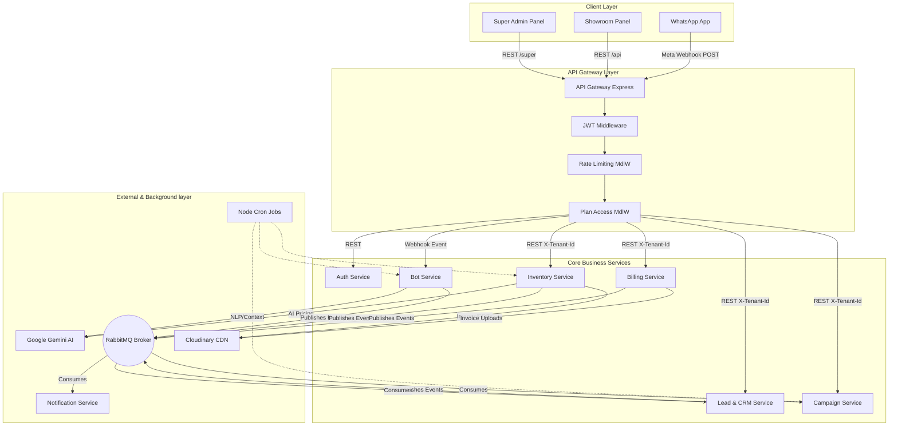
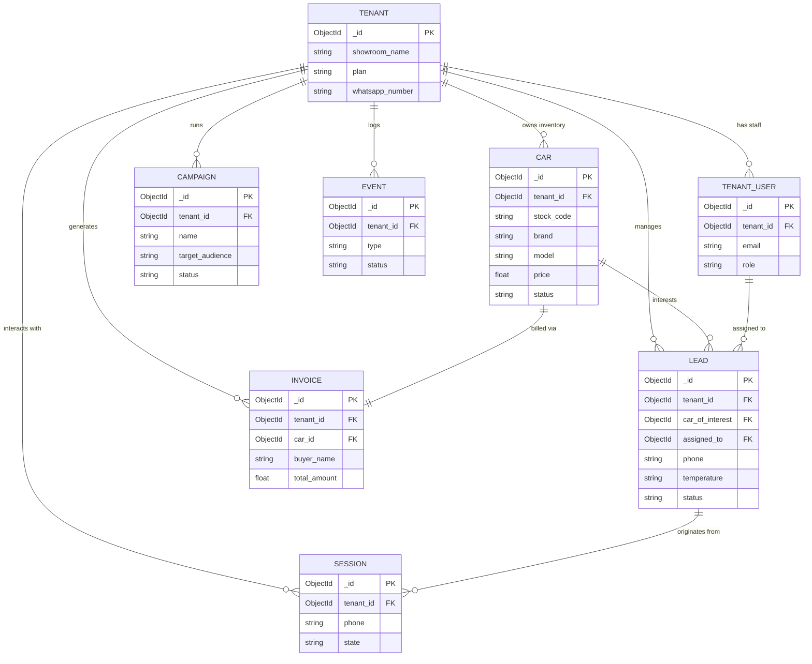
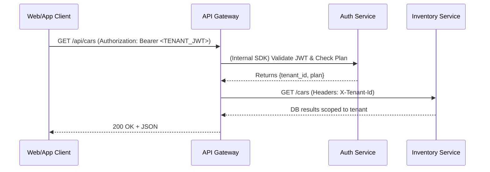
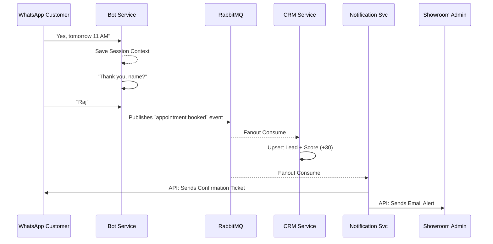

# CarBot AI — System Design Document
### HLD · LLD per Service · Database Design · Service Communication

> **Version:** 1.0 | **Date:** March 2026 | **Author:** Architecture Team

---

## Table of Contents

1. [High-Level Design (HLD)](#1-high-level-design)
   - 1.1 System Overview
   - 1.2 Architecture Diagram
   - 1.3 Technology Stack
   - 1.4 Multi-Tenancy Model
   - 1.5 SaaS Plan Tiers
2. [Low-Level Design (LLD) — Per Service](#2-low-level-design-per-service)
   - 2.1 API Gateway
   - 2.2 Auth Service
   - 2.3 Inventory Service
   - 2.4 WhatsApp Bot Service
   - 2.5 Lead & CRM Service
   - 2.6 Campaign Service
   - 2.7 Billing & ERP Service
   - 2.8 Notification Service
   - 2.9 Analytics Service
   - 2.10 Website Builder Service (Optional)
3. [Database Design](#3-database-design)
   - 3.1 Auth Service DB
   - 3.2 Inventory Service DB
   - 3.3 Bot Service DB
   - 3.4 CRM Service DB
   - 3.5 Campaign Service DB
   - 3.6 Billing Service DB
   - 3.7 Analytics Service DB
   - 3.8 Notification Service DB
   - 3.9 Indexes & Partitioning Strategy
4. [Service Communication & DB Interactions](#4-service-communication--db-interactions)
   - 4.1 Synchronous (REST) Communication
   - 4.2 Asynchronous (Event-Driven) Communication
   - 4.3 Domain Event Catalog
   - 4.4 Key Cross-Service Flows
   - 4.5 DB Interaction per Flow
5. [Coding Standards & Best Practices](#5-coding-standards--best-practices)

---

## 1. High-Level Design

### 1.1 System Overview

**CarBot AI** is a cloud-native, multi-tenant SaaS platform designed for Indian used-car dealerships. It replaces fragmented manual tools (WhatsApp groups, Excel, Word invoices) with an integrated platform that automates customer engagement, manages inventory intelligently, tracks leads, runs marketing campaigns, and generates GST-compliant invoices — all served to multiple showroom tenants on a shared infrastructure.

#### Three Access Points

| Portal | URL | Users |
|--------|-----|-------|
| **Super Admin Panel** | `admin.carbotai.in` | Platform owner — manages all tenants, plans, WhatsApp configs |
| **Showroom Admin Panel** | `panel.carbotai.in` | Showroom owners & staff — inventory, leads, billing, campaigns |
| **WhatsApp Chatbot** | Tenant-owned WA number | End customers — search cars, EMI quotes, book test drives |

#### Seven Functional Modules

| # | Module | Responsibility |
|---|--------|----------------|
| 1 | **Inventory Management** | Car CRUD, VIN/RC/insurance, 360° media, pricing, aging alerts |
| 2 | **WhatsApp Automation** | AI chatbot, NLP search, EMI calculator, test drive booking |
| 3 | **Lead & CRM** | Lead capture, Hot/Warm/Cold scoring, pipeline, agent assignment |
| 4 | **Campaign & Marketing** | WA/Email campaigns, festival triggers, new stock broadcasts |
| 5 | **Billing & ERP** | GST invoice PDF, expense tracking, per-car P&L |
| 6 | **Analytics** | Revenue dashboards, sales funnel, agent KPIs, marketing ROI |
| 7 | **Website Builder** *(Pro/Enterprise)* | Auto-generated SEO showroom websites with live inventory |

---

### 1.2 Architecture Diagram

```
┌──────────────────────────────────────────────────────────────────┐
│                    CARBOT AI PLATFORM                            │
│  [Super Admin Panel]            [Showroom Admin Panel]           │
│  admin.carbotai.in              panel.carbotai.in                │
│  React + Vite (SUPER_JWT)       React + Vite (TENANT_JWT)        │
└───────────────┬─────────────────────────┬────────────────────────┘
                │  HTTPS                  │  HTTPS
                ▼                         ▼
┌──────────────────────────────────────────────────────────────────┐
│                  API GATEWAY  (port 3000)                        │
│  • JWT Validation (TENANT_JWT / SUPER_JWT)                       │
│  • Tenant scoping — injects X-Tenant-Id header                   │
│  • Rate limiting (100 req/min per tenant)                        │
│  • Plan-limit feature gating                                     │
│  • Request logging + trace_id injection                          │
│  • HTTP reverse proxy to all microservices                       │
└──┬───────┬──────┬──────┬───────┬────────┬────────┬──────────────┘
   │       │      │      │       │        │        │
   ▼       ▼      ▼      ▼       ▼        ▼        ▼
[Auth]  [Inv]  [Bot]  [CRM]  [Camp]  [Bill]  [Analytics]
 3001   3002   3003   3004    3005    3006      3007
   │       │      │      │       │        │        │
[MongoDB][MongoDB][MongoDB][MongoDB][MongoDB][MongoDB][MongoDB]
  :27017  :27018  :27019  :27020   :27021   :27022   :27023

                     [Notification Svc  :3008]
                     [Website Builder   :3009]  (optional)

                ┌──────────────────────────────┐
                │  MESSAGE BROKER (RabbitMQ)    │
                │  amqp://rabbitmq:5672         │
                │  Exchanges, Queues, DLQ       │
                └──────────────┬───────────────┘
                               │ (fanout/direct)
              ┌────────────────┼──────────────────┐
              ▼                ▼                  ▼
          [Bot Svc]      [CRM Svc]       [Analytics Svc]
          [Campaign]     [Notif Svc]     [Website Bldr]

              ┌─────────────────────────────────────┐
              │  EXTERNAL SERVICES                  │
              │  • Meta WhatsApp Cloud API          │
              │  • Google Gemini API (NLP + Price)  │
              │  • Cloudinary (media CDN)           │
              │  • Resend / Nodemailer (email)      │
              └─────────────────────────────────────┘

              ┌─────────────────────────────────────┐
              │  OBSERVABILITY STACK                │
              │  • Prometheus + Grafana (metrics)   │
              │  • OpenTelemetry + Jaeger (traces)  │
              │  • Grafana Loki (logs)              │
              └─────────────────────────────────────┘
```

---

### 1.3 Technology Stack

| Layer | Technology | Purpose |
|-------|-----------|---------|
| Frontend | React + Vite | Showroom Panel & Super Admin Panel |
| Backend Services | Node.js + Express + TypeScript | REST APIs per microservice |
| Database | MongoDB + Mongoose | DB-per-service pattern |
| AI / NLP | Google Gemini API | Natural language car search, AI pricing, captions |
| Fuzzy Search | Fuse.js | Spelling-tolerant brand/model matching in bot |
| WhatsApp | Meta WhatsApp Cloud API | Inbound webhook + outbound messages |
| Media Storage | Cloudinary | Images, videos, 360° frames, PDFs (per-tenant folder) |
| Message Broker | RabbitMQ | Async domain events, dead-letter queues |
| API Gateway | Express (custom) | Routing, auth, rate-limiting, plan gating |
| Auth | JWT + bcrypt | Two separate JWT secrets for tenant vs super-admin |
| Session Store | MongoDB | WhatsApp bot conversation state |
| Email | Resend / Nodemailer | Campaigns, confirmations, onboarding |
| PDF Generation | pdfkit / Puppeteer | GST invoices, delivery notes |
| Encryption | crypto-js AES | WhatsApp access tokens (encrypted at rest) |
| Cron Jobs | node-cron | Aging alerts, insurance expiry, follow-ups, session cleanup |
| Containerization | Docker (multi-stage) | Reproducible per-service builds |
| Orchestration | Kubernetes (K8s) | Deployments, HPA, Ingress, Secrets, ConfigMaps |
| CI/CD | GitHub Actions | Lint → Test → Build → Push → Deploy → Rollback |
| Logging | Grafana Loki + Promtail | Structured JSON logs tagged with `tenant_id` + `trace_id` |
| Tracing | OpenTelemetry + Jaeger | Distributed traces across all services |
| Metrics | Prometheus + Grafana | Request rate, P95 latency, error rate, queue depth |

---

### 1.4 Multi-Tenancy Model

- **Tenant = Showroom.** Every registered showroom is an isolated tenant.
- **Shared Infrastructure:** All tenants run on the SAME set of microservices and Kubernetes cluster. Isolation is achieved at the data layer via `tenant_id` field on every document.
- **WhatsApp Routing:** The `phone_number_id` in the Meta webhook payload identifies the tenant. One webhook endpoint serves all showrooms.
- **Subscription is manual:** Super Admin activates a showroom after receiving offline payment (UPI/bank). No payment gateway.
- **JWT carries tenant context:** Every request carries a `TENANT_JWT` containing `{ tenant_id, user_id, role }`. Gateway injects `X-Tenant-Id` header for downstream services.

---

### 1.5 SaaS Plan Tiers

| Feature | Trial | Basic ₹999/mo | Pro ₹2499/mo | Enterprise ₹4999/mo |
|---------|-------|--------------|--------------|----------------------|
| Cars in Inventory | 10 | 50 | 200 | Unlimited |
| Leads / month | 50 | 300 | 1,000 | Unlimited |
| WhatsApp Bot | ✅ | ✅ | ✅ | ✅ |
| Basic CRM | ✅ | ✅ | ✅ | ✅ |
| GST Invoice | ❌ | ✅ | ✅ | ✅ |
| EMI Calculator | ❌ | ✅ | ✅ | ✅ |
| AI Price Suggestion | ❌ | ❌ | ✅ | ✅ |
| 360° Car View | ❌ | ❌ | ✅ | ✅ |
| WhatsApp Campaigns | ❌ | ❌ | ✅ | ✅ |
| Full Analytics | ❌ | Basic | Full | Full + Export |
| Website Builder | ❌ | Subdomain | ✅ + Domain | ✅ |
| Incentive Tracking | ❌ | ❌ | ✅ | ✅ |

---

## 2. Low-Level Design (LLD) — Per Service

### LLD Component Interaction Diagram



### 2.1 API Gateway
- **Type:** Node.js + Express (or Kong in Kubernetes)
- **Role:** Single public entry point. Routes requests to `http://<service-name>:300x/...`
- **Responsibilities:**
  - **Auth Enforcement:** Validates `TENANT_JWT` on `/api/*` routes and `SUPER_JWT` on `/super/*` routes.
  - **Context Injection:** Adds `X-Tenant-Id`, `X-User-Role`, and `X-Plan` headers to downstream requests.
  - **Rate Limiting:** `express-rate-limit` (e.g., 100 req/min/tenant).
  - **Feature Gating:** `planLimit.middleware.js` blocks restricted routes (e.g., `/api/campaigns` blocked for Basic plan).
  - **Observability:** Injects `trace_id` for OpenTelemetry, logs access requests.

### 2.2 Auth Service
- **Type:** Node.js + Express
- **Role:** Identity, Multi-Tenant Management, and Access Control.
- **Endpoints:**
  - `POST /auth/register` (Tenant signs up, `is_access_active: false`)
  - `POST /auth/login` (Tenant logs in, issues `TENANT_JWT`)
  - `POST /super/login` (Admin logs in, issues `SUPER_JWT`)
  - Super Admin API: `PATCH /super/tenants/:id/access` (Assigns plan, sets expiry datetimes)
  - Super Admin API: `PUT /super/tenants/:id/whatsapp-config` (Encrypts token with `crypto-js`)
- **Key Middleware Logic:** `tenantAuth.middleware.js` blocks access if `tenant.is_access_active = false` or `access_valid_until` has passed.

### 2.3 Inventory Service
- **Type:** Node.js + Express
- **Role:** Manages the full car lifecycle from acquisition to sale.
- **Key Features:**
  - **Dynamic Forms:** Renders form fields specified by Super Admin `FormField` DB schema.
  - **Media & Assets:** Multi-image upload, video links, 360° spin images arrays, and document storage (RC/Insurance via Cloudinary per-tenant folder scheme).
  - **Financials:** Tracks purchase, refurb, repairs, sold prices, and computes Net Profit on sale.
  - **Aging Intelligence:** Computes Days-in-Inventory in real-time.
  - **Cron Jobs:** `node-cron` fires daily at 9am to publish `car.aging_alert` and `insurance.expiring` to RabbitMQ.
  - **AI Pricing:** `GET /ai-price` calls Gemini for suggested max/min price with reasoning.

### 2.4 WhatsApp Bot Service
- **Type:** Node.js + Express
- **Role:** Customer-facing AI chatbot. Multi-tenant router via Meta Webhooks.
- **Key Modules:**
  - **Webhook Router:** `POST /webhook` extracts `phone_number_id`, looks up tenant, sets MongoDB Session, parses incoming text/interactive message.
  - **State Machine Engine:** Translates context between `IDLE`, `MENU`, `SEARCH`, `CAR_DETAIL`, `BOOKING`, `AWAIT_NAME`.
  - **Gemini NLP:** Parses messy user text ("diesel SUV manual under 12L") into JSON search params.
  - **Fuzzy Search:** `fuse.js` matches misspellings against that tenant's Inventory Service data.
  - **EMI Calculator:** Flow triggered by "loan", interactive buttons for DP and Time.
  - **Follow-up Cron:** Auto-messages leads not responding after Day 1, Day 3, Day 7.

### 2.5 Lead & CRM Service
- **Type:** Node.js + Express
- **Role:** Manages customer pipelines, agent tracking, and lead scoring.
- **Key Modules:**
  - **Lead Capture:** Triggered manually or by `lead.created` RabbitMQ event from Bot/Website. Performs deduplication based on Phone.
  - **Scoring Engine:** (+30 booked test drive, +20 viewed car, -10 bounced). Automatically updates `Temperature` (Hot/Warm/Cold).
  - **Pipeline Manager:** Tracks state (Contacted -> Negotiation -> Closed).
  - **Agent Assignments:** Assigns staff, tracks call logs, and handles next follow-up dates.

### 2.6 Campaign Service
- **Type:** Node.js + Express
- **Role:** Marketing automation, broadcasts, and targeted messaging.
- **Key Modules:**
  - **Audience Segmentation:** Combines CRM data (Temperature) + Inventory data (Search Intent) to build recipient lists.
  - **Templating & Delivery:** Personalizes `{name}` and `{car_name}`. Sends via Meta Cloud API or Resend (email).
  - **Festival Cron Engine:** Auto-drafts Diwali/New Year campaigns 3 days prior.
  - **Tracking:** Listens for read/delivered Webhook receipts to update campaign stats.

### 2.7 Billing & ERP Service
- **Type:** Node.js + Express
- **Role:** Bookkeeping, invoicing, and expense tracking.
- **Key Modules:**
  - **GST Invoicing:** PDF generation (`pdfkit`/`Puppeteer`) tracking CGST/SGST/IGST. Sequential invoice numbers per tenant.
  - **Delivery Notes:** Auto-generates handover checklists for signature when a car sells.
  - **Expense Ledger:** Tracks overheads vs. per-car repairs.
  - **P&L Engine:** Computes monthly net profit aggregating Sales Revenue - Direct Car Expenses - Showroom Overheads.

### 2.8 Notification Service
- **Type:** Node.js + Express
- **Role:** Pure event consumer for centralized messaging to staff and customers.
- **Key Features:**
  - **Idempotency Check:** Maintains `ProcessedEvent` DB to ensure no duplicate notifications.
  - **Dead-Letter Queue:** Automatically retries failed Meta API or Email API calls with exponential backoff.
  - **Routing:** Triggers WhatsApp payloads using decrypted internal secrets based on event payloads (`appointment.booked`, `car.aging_alert`).

### 2.9 Analytics Service
- **Type:** Node.js + Express
- **Role:** Dashboards, metrics tracking, and platform intelligence.
- **Key Modules:**
  - **Aggregator Jobs:** Periodically queries Bot, CRM, and Billing DBs via REST APIs to cache compiled stats (or reads from replicas).
  - **Dashboards:** Sales Funnel rates, Agent conversion %, Avg Days to Sell by model, MoM Growth figures.
  - **Export Engine:** Dumps detailed ledger/KPI CSVs for Excel or CA reviews.

### 2.10 Website Builder Service (Optional)
- **Type:** Next.js (SSR) + Express Backend
- **Role:** Tenant-branded public web portal.
- **Key Features:**
  - **Domain Routing:** Ingress controller routes `{showroom}.carbotai.in` to dynamic Subdomains, fetching specific Tenant contexts.
  - **SEO Module:** Auto-generates semantic HTML and `Schema.org` Vehicle markup per car.
  - **Cache Sync:** Listens to `car.added`/`car.sold` events to update its SSR cache for immediate sub-second page loads.

---

## 3. Database Design

Each microservice operates its own MongoDB instance (DB-per-service pattern).

### 3.1 Auth Service DB
*Access Control Source of Truth*
```javascript
// Tenant Collection
{
  _id: ObjectId,
  showroom_name: "Hari Priya Cars",
  slug: "hari-priya",
  whatsapp_phone_number_id: "1234567890",
  whatsapp_access_token: "enc_aes:af987a0...", // AES Encrypted
  is_access_active: true,
  access_valid_until: ISODate,
  plan: "pro", // 'trial', 'basic', 'pro', 'enterprise'
  max_cars: 200,
  max_leads_per_month: 1000
}

// TenantUser Collection
{
  _id: ObjectId,
  tenant_id: ObjectId, // Refs Tenant
  email: "owner@showroom.com",
  password_hash: "bcrypt_hash",
  role: "admin", // 'admin', 'agent'
}

// FormField Collection (Global)
{
  _id: ObjectId,
  name: "Fuel Type",
  type: "select",
  options: ["Petrol", "Diesel", "EV", "CNG"],
  required: true,
  order: 1
}
```

### 3.2 Inventory Service DB
```javascript
// Car Collection
{
  _id: ObjectId,
  tenant_id: ObjectId,
  stock_code: "HP-001",
  brand: "Hyundai",
  model: "Creta",
  price: 1200000,
  status: "available", // 'available', 'sold'
  images: ["url1", "url2"],
  spin_images: ["url1", "url2", "...24"],
  vin: "1HGCM8...",
  rc_number: "KA01AB1234",
  insurance_expiry: ISODate,
  listed_date: ISODate,
  purchase_price: 1050000,
  refurb_cost: 20000,
  sold_price: null,
  profit_margin: null,
  ai_suggested_price_min: 1100000,
  ai_suggested_price_max: 1250000,
  service_history: [{ date: ISODate, text: "Oil Change", cost: 5000 }]
}
```

### 3.3 Bot Service DB
```javascript
// Session Collection
{
  _id: ObjectId,
  tenant_id: ObjectId,
  phone: "919876543210", // Customer phone
  state: "SEARCH_RESULTS",
  context: {
    filters: { brand: "Hyundai", max_price: 1500000 },
    current_page: 1,
    current_car_id: ObjectId
  },
  last_active_at: ISODate // Used for 24h cron expiry
}
```

### 3.4 CRM Service DB
```javascript
// Lead Collection
{
  _id: ObjectId,
  tenant_id: ObjectId,
  phone: "919876543210",
  name: "Ramesh Singh",
  source: "whatsapp",
  temperature: "hot", // 'hot', 'warm', 'cold'
  score: 65,
  status: "negotiation", // 'new', 'contacted', 'test_drive', 'negotiation', 'closed'
  car_of_interest: ObjectId, // Refs Car (Soft reference)
  assigned_to: ObjectId, // Refs TenantUser
  follow_up_date: ISODate,
  call_logs: [{ date: ISODate, outcome: "Interested", notes: "Wants test drive" }]
}
```

### 3.5 Campaign Service DB
```javascript
// Campaign Collection
{
  _id: ObjectId,
  tenant_id: ObjectId,
  name: "Diwali Bonanza",
  type: "whatsapp", // 'whatsapp', 'email'
  target_audience: "hot_leads", // 'hot_leads', 'all_leads', 'past_buyers'
  template_id: "diwali_offer_01",
  scheduled_at: ISODate,
  status: "completed", // 'draft', 'scheduled', 'running', 'completed'
  stats: {
    sent: 150,
    delivered: 145,
    read: 120,
    replied: 15
  }
}
```

### 3.6 Billing Service DB
```javascript
// Invoice Collection
{
  _id: ObjectId,
  tenant_id: ObjectId,
  invoice_no: "INV-2026-042",
  car_id: ObjectId, // Soft reference
  buyer_name: "Ramesh Singh",
  buyer_address: "...",
  base_price: 1016949, // Math: 1200000 / 1.18
  sgst: 91525,  // 9%
  cgst: 91525,  // 9%
  total_amount: 1200000,
  pdf_url: "cloudinary_url",
  created_at: ISODate
}

// Expense Collection
{
  _id: ObjectId,
  tenant_id: ObjectId,
  description: "Showroom Rent",
  category: "Fixed", // 'Fixed', 'Variable'
  amount: 50000,
  date: ISODate
}
```

### 3.7 Analytics Service DB
```javascript
// AnalyticsCache Collection
{
  _id: ObjectId,
  tenant_id: ObjectId,
  month: "2026-03",
  total_leads: 350,
  cars_sold: 12,
  revenue: 14500000,
  total_profit: 850000,
  avg_days_to_sell: 18,
  leads_by_temperature: { hot: 50, warm: 100, cold: 200 }
}
```

### 3.8 Notification Service DB
```javascript
// ProcessedEvent Collection (For Idempotency)
{
  _id: ObjectId,
  event_id: "msg-uuid-1234",
  tenant_id: ObjectId,
  type: "appointment.booked",
  processed_at: ISODate,
  status: "success", // 'success', 'failed'
  error_log: null
}
```

### 3.9 Indexes & Partitioning Strategy
- **Indexes:** Every collection must have a compound index on `{ tenant_id: 1, _id: 1 }` or `{ tenant_id: 1, secondary_field: 1 }` (e.g., `phone` in Leads).
- **Partitioning Data:** Since this is Multi-Tenant on shared DBs, scoping all Mongoose queries by `tenant_id` from the `req.user` JWT is absolutely critical.

### 3.10 Database Entity-Relationship Diagram

*Conceptually, entities relate to each other across microservices via soft references (e.g., `tenant_id`, `car_id`).*



---

## 4. Service Communication & DB Interactions

### 4.1 Synchronous (REST) Communication
Synchronous calls are strictly limited to avoid cascading failures. Used primarily by the API Gateway to route to services, and Analytics/Billing Aggregating from other APIs where data freshness requires real-time pull over async.



### 4.2 Asynchronous (Event-Driven) Communication
RabbitMQ acts as the central nerve system. We use fanout / topic exchanges where Publisher knows nothing about Consumers.

**Benefits:**
- High availability (Bot keeps working if CRM is down).
- Scalability (We can add new consumers later, like Website Builder, without changing Inventory code).

### 4.3 Domain Event Catalog

| Event Topic | Published By | Consumed By | Payload Snapshot |
|-------------|-------------|-------------|------------------|
| `tenant.access_changed` | Auth | All Services | `{ tenant_id, is_active, plan }` (Cache refresh) |
| `car.added` | Inventory | Campaign, Website | `{ tenant_id, car_id, brand, budget_tier }` |
| `car.sold` | Inventory | Campaign, Analytics, Website | `{ tenant_id, car_id, profit, sold_price }` |
| `car.aging_alert`| Inventory | Notification | `{ tenant_id, car_id, days_in_stock }` |
| `insurance.expiring`| Inventory| Notification | `{ tenant_id, car_id, days_left }` |
| `lead.created` | CRM | Notification | `{ tenant_id, lead_id, name, score }` |
| `appointment.booked`| Bot | CRM, Notification | `{ tenant_id, phone, date, name, car_id }` |
| `lead.scored` | CRM | Notification | `{ tenant_id, lead_id, new_score, new_temperature }` |
| `campaign.scheduled`| Campaign | Campaign | Cron re-publishes to itself to trigger execution |
| `invoice.created` | Billing | Notification | `{ tenant_id, invoice_id, pdf_url, customer_phone }` |

### 4.4 Key Cross-Service Workflow: Test Drive Booking

1. **Bot Service (WhatsApp)**: Customer says "Book Date: 24th March".
2. **Bot DB**: Updates Session `state` to `CONFIRMED`.
3. **Bot Service**: Publishes `appointment.booked` to RabbitMQ.
4. **CRM Service (Consumer)**: Hears event.
   - Updates/Creates Lead matching phone.
   - Increases Lead Score (`+30`).
   - Inserts Activity timeline.
5. **Notification Service (Consumer)**: Hears event.
   - Calls Meta API: WhatsApps customer "Confirmation for 24th...".
   - Calls Resend API: Emails Showroom owner.



### 4.5 DB Interaction Rules (Service to DB)
1. **Never reach across DBs directly.** The Bot Service cannot read the `Car` Collection in Inventory DB.
2. **If Bot needs Car info:** Bot uses REST (e.g. `GET http://inventory:3002/internal/cars/search?q=hyundai`) or maintains its own materialized view via consuming `car.added` / `car.updated` events.
3. **Soft References:** Always store `ObjectId` (like `car_id` in Lead schema) as string-like soft references. Joins happen at the API Gateway level (API Composition) or via explicit UI sub-requests.

---

## 5. Coding Standards & Best Practices

To ensure maintainability and consistency across CarBot AI, all developers must adhere to the following conventions across both frontend and backend codebases.

### 5.1 Naming Conventions
- **Files & Directories:** `kebab-case` for folders and non-component files (e.g., `auth.controller.ts`, `api-client.ts`). `PascalCase` for React components (e.g., `VehicleDetail.tsx`).
- **Variables & Functions:** `camelCase` (e.g., `getUserData`, `isModalOpen`).
- **Classes & Models:** `PascalCase` (e.g., `UserRepository`, `InventoryService`).
- **Constants & Enums:** `UPPER_SNAKE_CASE` (e.g., `MAX_RETRY_COUNT`, `Roles.SUPER_ADMIN`).
- **Private Variables / Methods:** Prefix with an underscore `_` (e.g., `_initializeConnection()`, `_internalState`).

### 5.2 TypeScript Usage
- **Strict Typing (Avoid `any`):** The use of the `any` type is strictly prohibited. Always define explicit interfaces or use specialized types. If a type is truly unknown, use `unknown` and assert/check types before usage.
- **Explicit Interfaces:** Payloads, DB models, and component props must have clear interfaces or type aliases exported from a central `types/` directory when shared.

### 5.3 Routes & Endpoints
- **Centralized Constants:** All frontend navigational routes and backend API endpoints must be defined as variables in a constants file (e.g., `API_ENDPOINTS.AUTH.LOGIN`, `APP_ROUTES.DASHBOARD`).
- **No Hardcoded Paths:** Never hardcode route strings in `href`, `<Link>`, or `fetch()` functions. This mitigates typos and streamlines global refactoring.

### 5.4 Linting & Formatting
- **ESLint Integration:** ESLint is mandatory for all projects (frontend and backend) to catch problematic patterns and enforce these guidelines automatically.
- **Zero Warnings:** All code must pass linting without warnings (`eslint . --ext .ts,.tsx`) before submission.
- **Prettier:** Code formatting must conform to the unified Prettier configuration for consistent styling.

---
