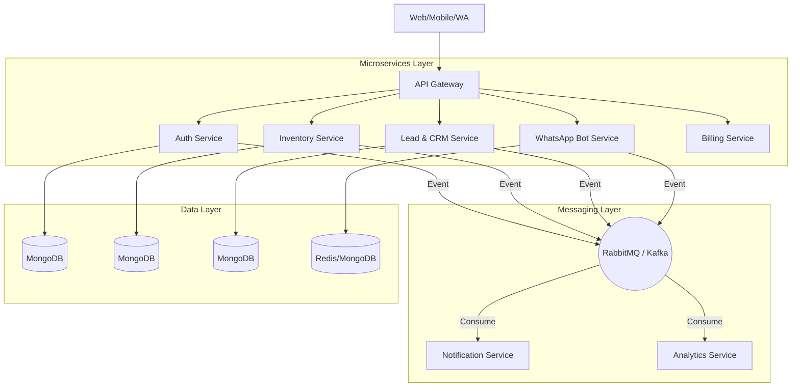

# CarBot AI — Microservices Backend Architecture & Structure

This document outlines the recommended structure and best practices for the CarBot AI backend. It is designed for scalability, maintainability, and high performance in a multi-tenant SaaS environment.

## 1. High-Level Architecture Pattern

The system follows a **Microservices Architecture** with a **Database-per-Service** pattern, coordinated by an **API Gateway** and an **Event-Driven Communication** layer.



---

## 2. Monorepo Organization (pnpm Workspaces)

A monorepo is essential for managing multiple microservices that share types, utilities, and configurations.

```text
/backend
├── /services              # Business Logic Services
│   ├── api-gateway        # Single entry point
│   ├── auth-service       # Identity & Tenant management
│   ├── inventory-service  # Car lifecycle
│   ├── bot-service        # WhatsApp AI & Session state
│   ├── crm-service        # Lead scoring & Pipelines
│   ├── billing-service    # Invoicing & ERP
│   └── notification-service # Event-driven dispatcher
├── /packages              # Shared internal libraries
│   ├── common             # Error classes, success handlers, utils
│   ├── logger             # Centralized Pino/Winston config
│   ├── middleware         # Shared Auth, Tenant, Validation middlewares
│   ├── types              # Shared TypeScript interfaces & DTOs
│   └── events             # Event schemas & Message Broker SDK
├── /infra                 # Global infrastructure
│   ├── k8s                # Kubernetes manifests (global resources)
│   ├── docker             # Shared Docker base images
│   └── scripts            # Deployment & CI/CD scripts
├── pnpm-workspace.yaml
└── turbo.json             # Turborepo for fast builds/tests
```

---

## 3. Service Internal Structure (Layered Architecture)

Each service should strictly follow a **Layered Architecture** to decouple concerns and make testing easier.

### Recommended Folder Structure for `/services/[service-name]/src`

| Folder | Purpose | Best Practice |
| :--- | :--- | :--- |
| `controllers/` | Entry point for HTTP requests. | Should only handle request validation and response mapping. |
| `services/` | **Core Business Logic.** | Pure logic. No DB calls; uses Repositories. |
| `repositories/` | Data Access Layer. | Interfaces with MongoDB/Mongoose. Eases DB migration/testing. |
| `models/` | DB Schemas. | Mongoose schemas tagged with `tenant_id` for isolation. |
| `dtos/` | Data Transfer Objects. | Input (request) and Output (response) data shapes. |
| `routes/` | API Route definitions. | Keeps `main.ts` clean by grouping routes logically. |
| `middleware/` | Service-specific logic. | Specific to this service (e.g., `fileUpload`). |
| `subscribers/` | Event Handlers. | Logic for processing messages from RabbitMQ. |
| `config/` | Config & Environment. | Centralized `env.config.ts` using `zod`/`joi` validation. |
| `utils/` | Local helpers. | Narrowly scoped utility functions. |

---

## 4. Key Design Patterns & Best Practices

### A. Multi-Tenant Data Isolation
- **Pattern:** Shared Database, Shared Schema (isolated by `tenant_id`).
- **Best Practice:** The API Gateway injects an `X-Tenant-Id` header. Each microservice uses a Mongoose middleware or a Global Plugin to automatically append `tenant_id` to every query:
  ```typescript
  schema.pre(['find', 'findOne', 'update'], function() {
    this.where({ tenant_id: requestContext.tenantId });
  });
  ```

### B. Standardized API Responses
Avoid inconsistent JSON structures. Use a shared `SuccessResponse` and `ErrorResponse` from `@carbot/common`.
- **Success:** `{ success: true, data: [...], meta: { total: 100 } }`
- **Error:** `{ success: false, code: "AUTH_EXPIRED", message: "...", traceId: "uuid" }`

### C. Event-Driven Communication
- **Pattern:** Pub/Sub via RabbitMQ.
- **Rule:** Never perform a "Distributed Transaction" across services. Use **Sagas** or **Eventual Consistency**.
- **Example:** `inventory-service` publishes `car.sold`, and `billing-service` listens to generate the invoice asynchronously.

### D. Centralized Observability
- **Logging:** Use `pino` for structured JSON logs. Include `tenant_id` and `trace_id` in every log.
- **Tracing:** Implement **OpenTelemetry** to trace a single request across the Gateway, Auth, and Inventory services (Distributed Tracing).
- **Metrics:** Expose a `/metrics` endpoint for Prometheus to monitor P95 latency and error rates.

### E. Defensive Programming
- **Validation:** Every request MUST be validated at the entry point using **Zod** or **Joi**.
- **Graceful Shutdown:** Handle `SIGTERM` signals to close DB connections and finish processing active requests before exit.
- **Circuit Breaker:** Use libraries like `opossum` when calling external APIs (Meta WhatsApp API, Gemini AI) to prevent cascading failures.

---

## 5. Deployment Strategy (Kubernetes)

- **Skaffold:** Use Skaffold for local development. It watches files and rebuilds/redeploys containers to a local K8s cluster (minikube/kind).
- **Helm:** Use Helm charts for managing complex K8s manifest sets.
- **ConfigMaps/Secrets:** Never hardcode secrets. Inject them via Kubernetes Secrets or a vault (HashiCorp Vault).

---

## Next Steps

1. **Scaffold Shared Packages:** Move logging and error handling to `packages/common`.
2. **Standardize Auth Middleware:** Ensure every service uses the same logic to decode JWT and verify tenant status.
3. **Establish Repository Pattern:** Refactor current services to separate DB logic from Business logic.
