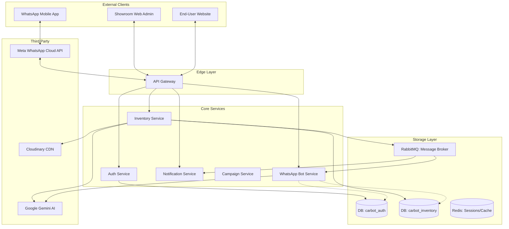

# 🏛️ CarBot AI — System Design Overview

CarBot AI is built on a **Modular Microservices Architecture** within a monorepo, designed for multi-tenancy and scalability.

---

### 🗺️ High-Level Architecture

---

### 📦 Component Breakdown

1.  **API Gateway (Express + `express-http-proxy`):**
    *   Single entry point for all frontend and webhook traffic.
    *   Handles **Auth Verification**, **Rate Limiting**, and **Request Routing**.
    *   *Port: 5000*

2.  **Auth Service:**
    *   Manages Showroom (Tenant) registration and User authentication.
    *   Implements **RBAC** (Owner, Manager, Staff).
    *   *Stats: Uses MongoDB `carbot_auth`.*

3.  **Inventory Service:**
    *   Core logic for car management, dynamic forms, and image uploads.
    *   Integrated with **Gemini AI** for price suggestions.
    *   Integrates with **Cloudinary** for media optimization.

4.  **WhatsApp Bot Service:**
    *   Handles real-time customer conversations via Meta Cloud API.
    *   Uses **Session Management** to track customer state.
    *   *Note: Currently "Reads" directly from Auth/Inventory DBs for performance (to be decoupled via PubSub).*

5.  **Common Package (`@carbot/common`):**
    *   Shared Middleware, Loggers, Exceptions, and Type definitions.
    *   Enforces consistent behavior across all microservices.

---

### 🛠️ Technology Stack
*   **Backend:** Node.js, TypeScript, Express.
*   **Frontend:** React, Tailwind CSS (Main Dashboard).
*   **Database:** MongoDB (using Mongoose).
*   **Infrastructure:** Docker, Turborepo, pnpm.
*   **AI:** Google Gemini (Generative models).
*   **Media:** Cloudinary (Automatic resizing & watermarking).
*   **Real-time:** Socket.io (for browser notifications).

---

### 🔐 Multi-Tenancy Strategy
CarBot AI uses a **"Shared Database, Shared Schema"** with a **Tenant ID Discriminator**.
*   Every record in MongoDB includes a `tenantId` field.
*   A custom Mongoose plugin in `@carbot/common` automatically injects `tenantId` filters into all queries (`find`, `update`, `delete`), ensuring data isolation between different car showrooms.
