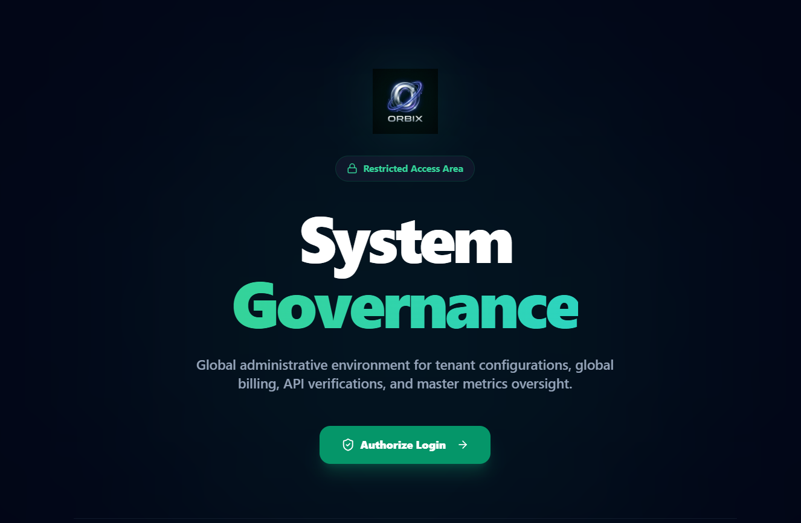
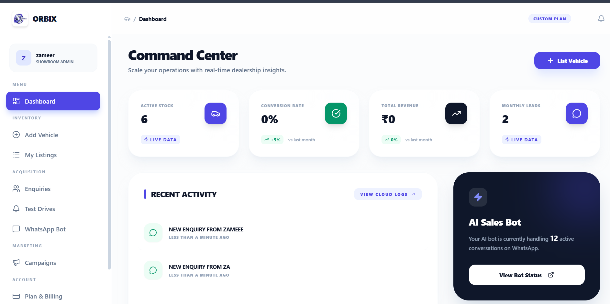
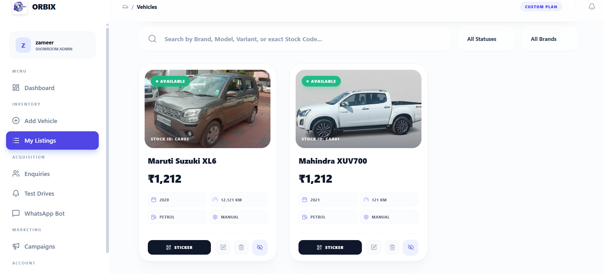
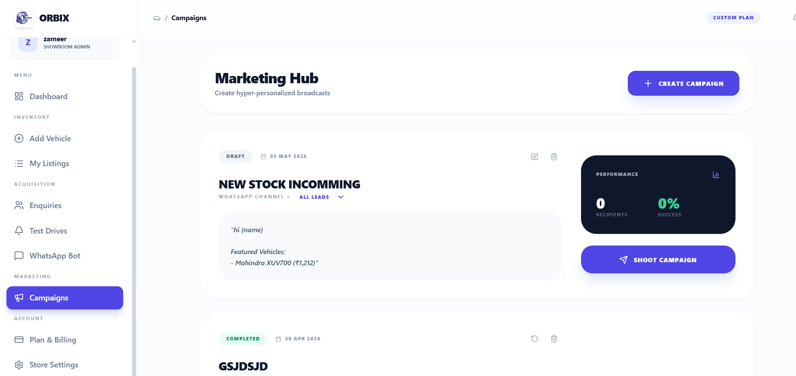
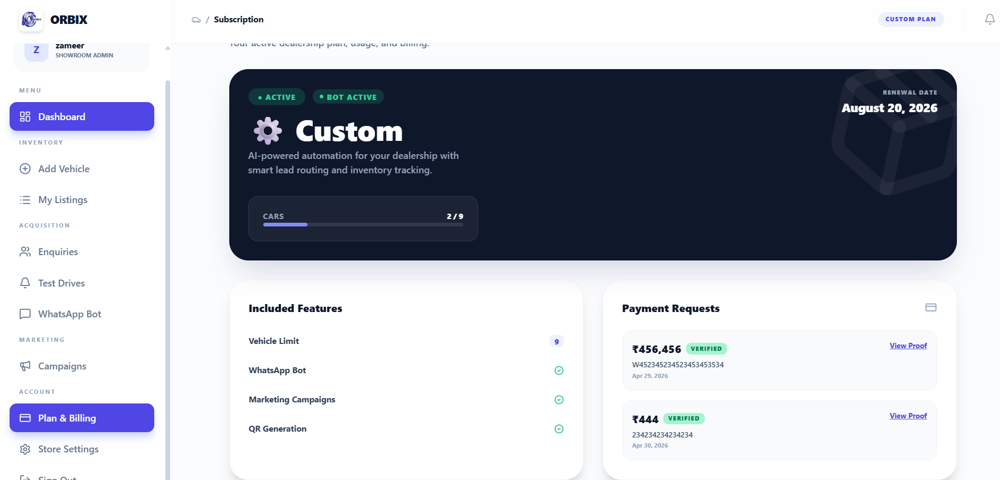
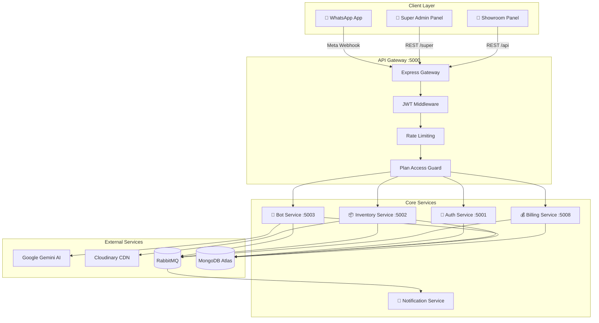

<div align="center">



# ORBIX — AI-Powered Showroom Management Platform

**The complete operating system for Indian used-car dealerships.**  
Automate WhatsApp conversations, manage inventory, capture leads, and run marketing campaigns — all from a single intelligent platform.

[](https://nodejs.org)
[](https://www.typescriptlang.org)
[](https://react.dev)
[](https://www.mongodb.com/atlas)
[](https://www.docker.com)
[](LICENSE)

</div>

---

## 📋 Table of Contents

- [Overview](#-overview)
- [Screenshots](#-screenshots)
- [Features](#-features)
- [Architecture](#-architecture)
- [Tech Stack](#-tech-stack)
- [Microservices](#-microservices)
- [Monitoring](#-monitoring)
- [Multi-Tenancy](#-multi-tenancy)

---

## 🚀 Overview

ORBIX is a cloud-native, **multi-tenant SaaS platform** designed specifically for the Indian used-car market. It replaces fragmented manual workflows — WhatsApp groups, Excel sheets, paper invoices — with an integrated, AI-driven platform that serves multiple showroom tenants on shared infrastructure.

### Three Access Points

| Portal | Users | Purpose |
|--------|-------|---------|
| 🏢 **Super Admin Panel** | Platform Owner | Manage all tenants, billing plans, global configs |
| 🚗 **Showroom Panel** | Showroom Owners & Staff | Inventory, leads, campaigns, WhatsApp bot |
| 📱 **WhatsApp Chatbot** | End Customers | Search cars, EMI quotes, book test drives |

---

## 📸 Screenshots

### Command Center — Showroom Dashboard
> Real-time insights into active stock, leads, revenue, and live AI bot conversations.



---

### Vehicle Inventory Management
> Search, filter, and manage your entire fleet. Generate printable stickers with a single click.



---

### Marketing Hub — Campaign Builder
> Create hyper-personalized WhatsApp broadcasts targeted at your existing leads with real-time performance tracking.



---

### Plan & Billing
> Transparent subscription management with usage tracking, included feature overview, and payment verification.



---

### System Governance — Super Admin
> A secure, restricted environment for global tenant management, API verification, and platform-wide oversight.


---

## ✨ Features

### 🤖 AI WhatsApp Sales Bot
- **Natural Language Search** — Customers type "budget car petrol automatic" and the bot finds the right vehicles using Google Gemini AI + Fuse.js fuzzy matching
- **EMI Calculator** — Instant financing estimates based on price, tenure, and rate
- **Multi-Step Test Drive Booking** — Date → Time slot selection with calendar prompts
- **Persistent Conversations** — Supports multi-turn sessions across multiple days
- **Lead Auto-Capture** — Every conversation creates a hot/warm/cold scored CRM lead

### 🚗 Smart Inventory Management
- Full vehicle CRUD with dynamic form fields (configurable per showroom)
- **360° Spin View** — Upload 24–36 sequential frames for an interactive spin experience
- **QR Code Generation** — Print car stickers; QR deep-links to your Kiosk website
- Aging alerts, RC/insurance expiry tracking
- Cloudinary CDN for high-quality images with automatic compression (50MB → optimized)

### 📢 Campaign & Marketing
- Broadcast to all leads via WhatsApp
- New stock announcements, festival triggers, follow-up sequences
- Real-time delivery and success rate tracking

### 💰 Billing & ERP
- GST-compliant invoice PDF generation
- Per-vehicle expense tracking (Purchase Price + Refurbishment + Expenses)
- Per-car Profit & Loss calculation

### 🔗 Kiosk Website Integration
- Set your showroom website URL in the admin panel
- All QR codes automatically deep-link to `[your-site]/inventory/[car-code]`
- WhatsApp bot responses include a "View Full Gallery" link

### 📊 Analytics & Observability
- Revenue dashboards, sales funnel visualization
- Agent KPI tracking
- Prometheus + Grafana metrics, Loki + Promtail log aggregation

---

## 🏗️ Architecture

ORBIX follows a **microservices architecture** behind a unified API Gateway. All services communicate via REST for synchronous operations and RabbitMQ for async domain events.



---

## 🛠️ Tech Stack

| Layer | Technology | Purpose |
|-------|-----------|---------|
| **Frontend** | React 18 + Vite + TypeScript | Showroom Panel & Super Admin UI |
| **State Management** | Redux Toolkit | Global caching, optimistic updates |
| **Backend** | Node.js + Express + TypeScript | REST APIs per microservice |
| **Database** | MongoDB Atlas + Mongoose | DB-per-service isolation pattern |
| **AI / NLP** | Google Gemini API | Natural language search, AI pricing |
| **Fuzzy Search** | Fuse.js | Spelling-tolerant car search in bot |
| **WhatsApp** | Meta WhatsApp Cloud API | Inbound webhooks + outbound messages |
| **Media Storage** | Cloudinary + Sharp | Images, 360° frames — auto-compressed |
| **Image Processing** | Sharp | Server-side resize & JPEG compression |
| **Message Broker** | RabbitMQ | Async domain events, dead-letter queues |
| **Auth** | JWT + bcrypt | Tenant-scoped & super-admin JWTs |
| **QR Codes** | qrcode (npm) | Vehicle sticker generation |
| **PDF** | pdfkit / Puppeteer | GST invoices, delivery notes |
| **Logging** | Grafana Loki + Promtail | Structured JSON logs, per-tenant tracing |
| **Metrics** | Prometheus + Grafana | Request rate, P95 latency, error rate |
| **Containerization** | Docker + Docker Compose | Reproducible service builds |

---

## 🔧 Microservices

| Service | Port | Database | Responsibility |
|---------|------|----------|---------------|
| `api-gateway` | 5000 | — | Routing, JWT auth, rate limiting, plan gating |
| `auth-service` | 5001 | `carbot_auth` | Tenants, users, OTP, roles, kiosk config |
| `inventory-service` | 5002 | `carbot_inventory` | Vehicles, brands, models, images, QR |
| `whatsapp-bot-service` | 5003 | `carbot_bot` | Bot logic, AI search, leads, test drives |
| `billing-service` | 5008 | `carbot_billing` | Invoices, expenses, P&L, subscription plans |
| `notification-service` | — | — | RabbitMQ consumer, email/WhatsApp alerts |


## 📊 Monitoring

ORBIX ships with a pre-configured observability stack.

```bash
cd server/monitoring
docker compose up -d
```

| Tool | URL | Purpose |
|------|-----|---------|
| **Grafana** | `http://localhost:3001` | Dashboards — metrics & logs |
| **Prometheus** | `http://localhost:9090` | Metrics collection |
| **Loki** | Internal | Log aggregation |

All services expose a `/metrics` endpoint for Prometheus scraping. Logs are tagged with `tenant_id` and `trace_id` for per-showroom debugging.

---

## 🏢 Multi-Tenancy Model

- **Tenant = Showroom.** Every registered showroom is an isolated tenant.
- **Shared Infrastructure.** All tenants share the same microservices; isolation is at the data layer via `tenant_id` on every document.
- **WhatsApp Routing.** The `phone_number_id` in the Meta webhook identifies the tenant. One webhook endpoint serves all showrooms.
- **Plan-Gated Features.** The API Gateway enforces plan limits (max vehicles, QR generation, campaigns) on every request.
- **JWT carries tenant context.** Every request carries a token with `{ tenant_id, user_id, role }`. Gateway injects `X-Tenant-Id` for downstream services.


<div align="center">
  <strong>Built with ❤️ for Indian Car Dealerships</strong><br/>
  <sub>ORBIX — Scale your showroom, powered by AI.</sub>
</div>
