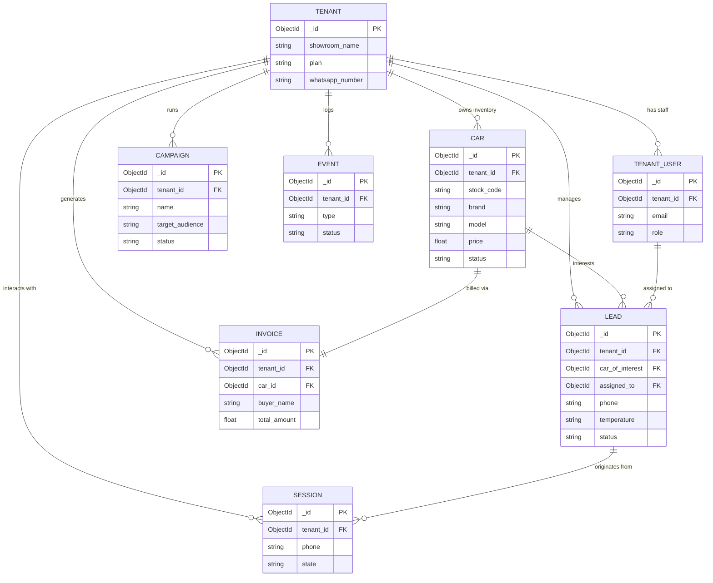

# 3. Database Design

Each microservice operates its own MongoDB instance (DB-per-service pattern).

### 3.1 Auth Service DB
*Access Control Source of Truth*
```javascript
// Tenant Collection
{
  _id: ObjectId,
  showroom_name: "Hari Priya Cars",
  slug: "hari-priya",
  whatsapp_phone_number_id: "1234567890",
  whatsapp_access_token: "enc_aes:af987a0...", // AES Encrypted
  is_access_active: true,
  access_valid_until: ISODate,
  plan: "pro", // 'trial', 'basic', 'pro', 'enterprise'
  max_cars: 200,
  max_leads_per_month: 1000
}

// TenantUser Collection
{
  _id: ObjectId,
  tenant_id: ObjectId, // Refs Tenant
  email: "owner@showroom.com",
  password_hash: "bcrypt_hash",
  role: "admin", // 'admin', 'agent'
}

// FormField Collection (Global)
{
  _id: ObjectId,
  name: "Fuel Type",
  type: "select",
  options: ["Petrol", "Diesel", "EV", "CNG"],
  required: true,
  order: 1
}
```

### 3.2 Inventory Service DB
```javascript
// Car Collection
{
  _id: ObjectId,
  tenant_id: ObjectId,
  stock_code: "HP-001",
  brand: "Hyundai",
  model: "Creta",
  price: 1200000,
  status: "available", // 'available', 'sold'
  images: ["url1", "url2"],
  spin_images: ["url1", "url2", "...24"],
  vin: "1HGCM8...",
  rc_number: "KA01AB1234",
  insurance_expiry: ISODate,
  listed_date: ISODate,
  purchase_price: 1050000,
  refurb_cost: 20000,
  sold_price: null,
  profit_margin: null,
  ai_suggested_price_min: 1100000,
  ai_suggested_price_max: 1250000,
  service_history: [{ date: ISODate, text: "Oil Change", cost: 5000 }]
}
```

### 3.3 Bot Service DB
```javascript
// Session Collection
{
  _id: ObjectId,
  tenant_id: ObjectId,
  phone: "919876543210", // Customer phone
  state: "SEARCH_RESULTS",
  context: {
    filters: { brand: "Hyundai", max_price: 1500000 },
    current_page: 1,
    current_car_id: ObjectId
  },
  last_active_at: ISODate // Used for 24h cron expiry
}
```

### 3.4 CRM Service DB
```javascript
// Lead Collection
{
  _id: ObjectId,
  tenant_id: ObjectId,
  phone: "919876543210",
  name: "Ramesh Singh",
  source: "whatsapp",
  temperature: "hot", // 'hot', 'warm', 'cold'
  score: 65,
  status: "negotiation", // 'new', 'contacted', 'test_drive', 'negotiation', 'closed'
  car_of_interest: ObjectId, // Refs Car (Soft reference)
  assigned_to: ObjectId, // Refs TenantUser
  follow_up_date: ISODate,
  call_logs: [{ date: ISODate, outcome: "Interested", notes: "Wants test drive" }]
}
```

### 3.5 Campaign Service DB
```javascript
// Campaign Collection
{
  _id: ObjectId,
  tenant_id: ObjectId,
  name: "Diwali Bonanza",
  type: "whatsapp", // 'whatsapp', 'email'
  target_audience: "hot_leads", // 'hot_leads', 'all_leads', 'past_buyers'
  template_id: "diwali_offer_01",
  scheduled_at: ISODate,
  status: "completed", // 'draft', 'scheduled', 'running', 'completed'
  stats: {
    sent: 150,
    delivered: 145,
    read: 120,
    replied: 15
  }
}
```

### 3.6 Billing Service DB
```javascript
// Invoice Collection
{
  _id: ObjectId,
  tenant_id: ObjectId,
  invoice_no: "INV-2026-042",
  car_id: ObjectId, // Soft reference
  buyer_name: "Ramesh Singh",
  buyer_address: "...",
  base_price: 1016949, // Math: 1200000 / 1.18
  sgst: 91525,  // 9%
  cgst: 91525,  // 9%
  total_amount: 1200000,
  pdf_url: "cloudinary_url",
  created_at: ISODate
}

// Expense Collection
{
  _id: ObjectId,
  tenant_id: ObjectId,
  description: "Showroom Rent",
  category: "Fixed", // 'Fixed', 'Variable'
  amount: 50000,
  date: ISODate
}
```

### 3.7 Analytics Service DB
```javascript
// AnalyticsCache Collection
{
  _id: ObjectId,
  tenant_id: ObjectId,
  month: "2026-03",
  total_leads: 350,
  cars_sold: 12,
  revenue: 14500000,
  total_profit: 850000,
  avg_days_to_sell: 18,
  leads_by_temperature: { hot: 50, warm: 100, cold: 200 }
}
```

### 3.8 Notification Service DB
```javascript
// ProcessedEvent Collection (For Idempotency)
{
  _id: ObjectId,
  event_id: "msg-uuid-1234",
  tenant_id: ObjectId,
  type: "appointment.booked",
  processed_at: ISODate,
  status: "success", // 'success', 'failed'
  error_log: null
}
```

### 3.9 Indexes & Partitioning Strategy
- **Indexes:** Every collection must have a compound index on `{ tenant_id: 1, _id: 1 }` or `{ tenant_id: 1, secondary_field: 1 }` (e.g., `phone` in Leads).
- **Partitioning Data:** Since this is Multi-Tenant on shared DBs, scoping all Mongoose queries by `tenant_id` from the `req.user` JWT is absolutely critical.

### 3.10 Database Entity-Relationship Diagram

*Conceptually, entities relate to each other across microservices via soft references (e.g., `tenant_id`, `car_id`).*


