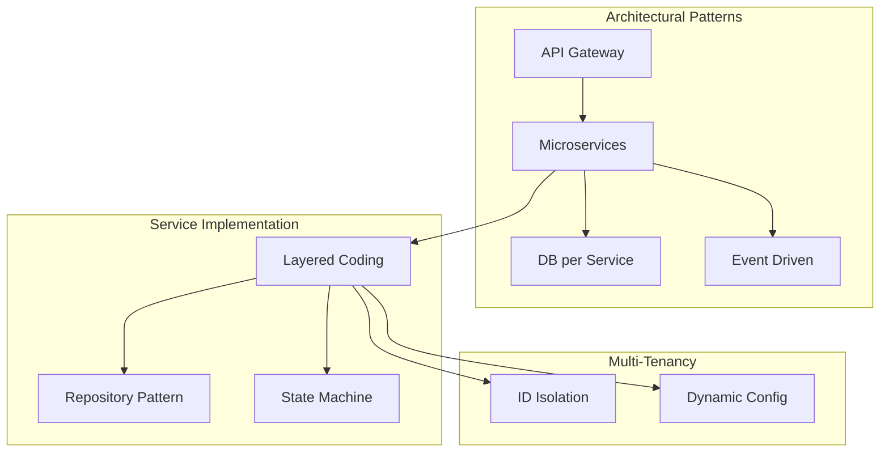

# Design Patterns

CarBot AI follows industry-standard design patterns to ensure scalability, maintainability, and multi-tenant isolation.

## 1. Architectural Patterns

### 1.1 Microservices Architecture
The system is divided into functional services (Auth, Inventory, Bot, CRM, etc.), each managing its own lifecycle and data.

### 1.2 API Gateway Pattern
A central entry point handles:
- Authentication (JWT verification)
- Request Routing
- Rate Limiting
- Protocol Translation

### 1.3 Database-per-Service
Each microservice has its own MongoDB instance to ensure loose coupling and independent scaling.

### 1.4 Event-Driven Architecture (EDA)
Uses RabbitMQ as a message broker for asynchronous communication (e.g., `appointment.booked` triggers CRM updates and Notifications).

---

## 2. Multi-Tenancy Patterns

### 2.1 Shared Database, Shared Schema
Tenant isolation is achieved at the application layer using a `tenant_id` on every document.

### 2.2 Dynamic Configuration
Showroom-specific settings (WhatsApp tokens, bot greetings, form fields) are loaded dynamically based on the tenant context.

---

## 3. Implementation Patterns

### 3.1 Layered Architecture (N-Tier)
Each service follows a strict hierarchy:
- **Routes:** Endpoint definitions.
- **Middleware:** Auth, validation, logging.
- **Controllers:** Request/Response handling.
- **Services:** Business logic & orchestrations.
- **Models:** Data structure & schemas.
- **Utils:** Reusable helpers.

### 3.2 Repository Pattern (Optional/Advised)
Used to abstract the data layer from business logic, making it easier to mock for unit testing.

### 3.3 Singleton Pattern
Used for database connectors, message broker clients, and expensive API clients (e.g., Gemini AI).

### 3.4 Factory Pattern
Used to generate dynamic WhatsApp message templates based on tenant-specific branding and logic.

### 3.5 Strategy Pattern
Used for different subscription plan logic (Trial vs Pro features) and notification delivery (WhatsApp vs Email).

### 3.6 State Pattern
The WhatsApp Bot uses a State Machine to manage conversation flow (`IDLE` -> `AWAITING_SEARCH` -> `RESULTS`).

---

## 4. Design Patterns Diagram

