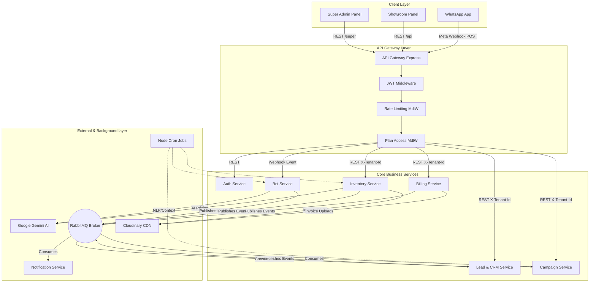

# 1. High-Level Design (HLD)

## 1.1 System Overview

**CarBot AI** is a cloud-native, multi-tenant SaaS platform designed for Indian used-car dealerships. It replaces fragmented manual tools (WhatsApp groups, Excel, Word invoices) with an integrated platform that automates customer engagement, manages inventory intelligently, tracks leads, runs marketing campaigns, and generates GST-compliant invoices — all served to multiple showroom tenants on a shared infrastructure.

#### Three Access Points

| Portal | URL | Users |
|--------|-----|-------|
| **Super Admin Panel** | `admin.carbotai.in` | Platform owner — manages all tenants, plans, WhatsApp configs |
| **Showroom Admin Panel** | `panel.carbotai.in` | Showroom owners & staff — inventory, leads, billing, campaigns |
| **WhatsApp Chatbot** | Tenant-owned WA number | End customers — search cars, EMI quotes, book test drives |

#### Seven Functional Modules

| # | Module | Responsibility |
|---|--------|----------------|
| 1 | **Inventory Management** | Car CRUD, VIN/RC/insurance, 360° media, pricing, aging alerts |
| 2 | **WhatsApp Automation** | AI chatbot, NLP search, EMI calculator, test drive booking |
| 3 | **Lead & CRM** | Lead capture, Hot/Warm/Cold scoring, pipeline, agent assignment |
| 4 | **Campaign & Marketing** | WA/Email campaigns, festival triggers, new stock broadcasts |
| 5 | **Billing & ERP** | GST invoice PDF, expense tracking, per-car P&L |
| 6 | **Analytics** | Revenue dashboards, sales funnel, agent KPIs, marketing ROI |
| 7 | **Website Builder** *(Pro/Enterprise)* | Auto-generated SEO showroom websites with live inventory |

---

## 1.2 Architecture Diagram

---

## 1.3 Technology Stack

| Layer | Technology | Purpose |
|-------|-----------|---------|
| Frontend | React + Vite | Showroom Panel & Super Admin Panel |
| Backend Services | Node.js + Express + TypeScript | REST APIs per microservice |
| Database | MongoDB + Mongoose | DB-per-service pattern |
| AI / NLP | Google Gemini API | Natural language car search, AI pricing, captions |
| Fuzzy Search | Fuse.js | Spelling-tolerant brand/model matching in bot |
| WhatsApp | Meta WhatsApp Cloud API | Inbound webhook + outbound messages |
| Media Storage | Cloudinary | Images, videos, 360° frames, PDFs (per-tenant folder) |
| Message Broker | RabbitMQ | Async domain events, dead-letter queues |
| API Gateway | Express (custom) | Routing, auth, rate-limiting, plan gating |
| Auth | JWT + bcrypt | Two separate JWT secrets for tenant vs super-admin |
| Session Store | MongoDB | WhatsApp bot conversation state |
| Email | Resend / Nodemailer | Campaigns, confirmations, onboarding |
| PDF Generation | pdfkit / Puppeteer | GST invoices, delivery notes |
| Encryption | crypto-js AES | WhatsApp access tokens (encrypted at rest) |
| Cron Jobs | node-cron | Aging alerts, insurance expiry, follow-ups, session cleanup |
| Containerization | Docker (multi-stage) | Reproducible per-service builds |
| Orchestration | Kubernetes (K8s) | Deployments, HPA, Ingress, Secrets, ConfigMaps |
| CI/CD | GitHub Actions | Lint → Test → Build → Push → Deploy → Rollback |
| Logging | Grafana Loki + Promtail | Structured JSON logs tagged with `tenant_id` + `trace_id` |
| Tracing | OpenTelemetry + Jaeger | Distributed traces across all services |
| Metrics | Prometheus + Grafana | Request rate, P95 latency, error rate, queue depth |

---

## 1.4 Multi-Tenancy Model

- **Tenant = Showroom.** Every registered showroom is an isolated tenant.
- **Shared Infrastructure:** All tenants run on the SAME set of microservices and Kubernetes cluster. Isolation is achieved at the data layer via `tenant_id` field on every document.
- **WhatsApp Routing:** The `phone_number_id` in the Meta webhook payload identifies the tenant. One webhook endpoint serves all showrooms.
- **Subscription is manual:** Super Admin activates a showroom after receiving offline payment (UPI/bank). No payment gateway.
- **JWT carries tenant context:** Every request carries a `TENANT_JWT` containing `{ tenant_id, user_id, role }`. Gateway injects `X-Tenant-Id` header for downstream services.

--