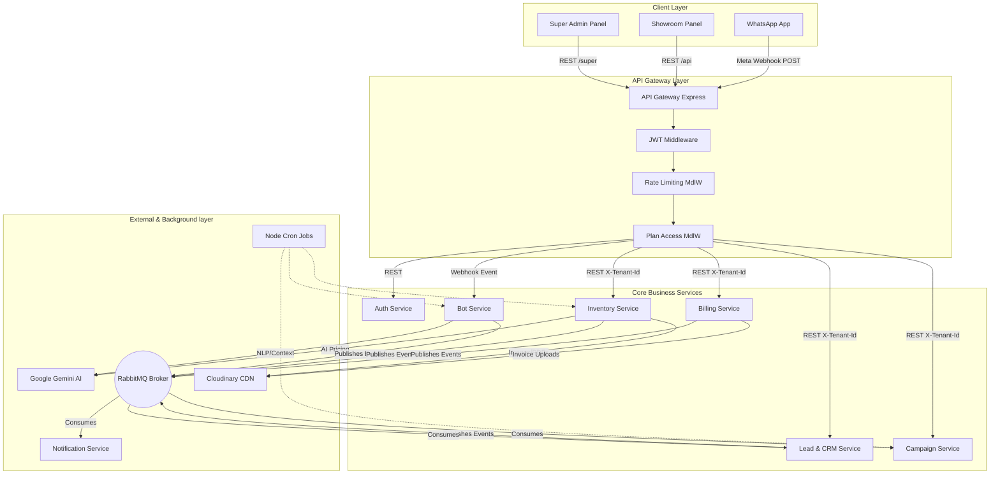

# 2. Low-Level Design (LLD) — Per Service

### LLD Component Interaction Diagram

### 2.1 API Gateway
- **Type:** Node.js + Express (or Kong in Kubernetes)
- **Role:** Single public entry point. Routes requests to `http://<service-name>:300x/...`
- **Responsibilities:**
  - **Auth Enforcement:** Validates `TENANT_JWT` on `/api/*` routes and `SUPER_JWT` on `/super/*` routes.
  - **Context Injection:** Adds `X-Tenant-Id`, `X-User-Role`, and `X-Plan` headers to downstream requests.
  - **Rate Limiting:** `express-rate-limit` (e.g., 100 req/min/tenant).
  - **Feature Gating:** `planLimit.middleware.js` blocks restricted routes (e.g., `/api/campaigns` blocked for Basic plan).
  - **Observability:** Injects `trace_id` for OpenTelemetry, logs access requests.

### 2.2 Auth Service
- **Type:** Node.js + Express
- **Role:** Identity, Multi-Tenant Management, and Access Control.
- **Endpoints:**
  - `POST /auth/register` (Tenant signs up, `is_access_active: false`)
  - `POST /auth/login` (Tenant logs in, issues `TENANT_JWT`)
  - `POST /super/login` (Admin logs in, issues `SUPER_JWT`)
  - Super Admin API: `PATCH /super/tenants/:id/access` (Assigns plan, sets expiry datetimes)
  - Super Admin API: `PUT /super/tenants/:id/whatsapp-config` (Encrypts token with `crypto-js`)
- **Key Middleware Logic:** `tenantAuth.middleware.js` blocks access if `tenant.is_access_active = false` or `access_valid_until` has passed.

### 2.3 Inventory Service
- **Type:** Node.js + Express
- **Role:** Manages the full car lifecycle from acquisition to sale.
- **Key Features:**
  - **Dynamic Forms:** Renders form fields specified by Super Admin `FormField` DB schema.
  - **Media & Assets:** Multi-image upload, video links, 360° spin images arrays, and document storage (RC/Insurance via Cloudinary per-tenant folder scheme).
  - **Financials:** Tracks purchase, refurb, repairs, sold prices, and computes Net Profit on sale.
  - **Aging Intelligence:** Computes Days-in-Inventory in real-time.
  - **Cron Jobs:** `node-cron` fires daily at 9am to publish `car.aging_alert` and `insurance.expiring` to RabbitMQ.
  - **AI Pricing:** `GET /ai-price` calls Gemini for suggested max/min price with reasoning.

### 2.4 WhatsApp Bot Service
- **Type:** Node.js + Express
- **Role:** Customer-facing AI chatbot. Multi-tenant router via Meta Webhooks.
- **Key Modules:**
  - **Webhook Router:** `POST /webhook` extracts `phone_number_id`, looks up tenant, sets MongoDB Session, parses incoming text/interactive message.
  - **State Machine Engine:** Translates context between `IDLE`, `MENU`, `SEARCH`, `CAR_DETAIL`, `BOOKING`, `AWAIT_NAME`.
  - **Gemini NLP:** Parses messy user text ("diesel SUV manual under 12L") into JSON search params.
  - **Fuzzy Search:** `fuse.js` matches misspellings against that tenant's Inventory Service data.
  - **EMI Calculator:** Flow triggered by "loan", interactive buttons for DP and Time.
  - **Follow-up Cron:** Auto-messages leads not responding after Day 1, Day 3, Day 7.

### 2.5 Lead & CRM Service
- **Type:** Node.js + Express
- **Role:** Manages customer pipelines, agent tracking, and lead scoring.
- **Key Modules:**
  - **Lead Capture:** Triggered manually or by `lead.created` RabbitMQ event from Bot/Website. Performs deduplication based on Phone.
  - **Scoring Engine:** (+30 booked test drive, +20 viewed car, -10 bounced). Automatically updates `Temperature` (Hot/Warm/Cold).
  - **Pipeline Manager:** Tracks state (Contacted -> Negotiation -> Closed).
  - **Agent Assignments:** Assigns staff, tracks call logs, and handles next follow-up dates.

### 2.6 Campaign Service
- **Type:** Node.js + Express
- **Role:** Marketing automation, broadcasts, and targeted messaging.
- **Key Modules:**
  - **Audience Segmentation:** Combines CRM data (Temperature) + Inventory data (Search Intent) to build recipient lists.
  - **Templating & Delivery:** Personalizes `{name}` and `{car_name}`. Sends via Meta Cloud API or Resend (email).
  - **Festival Cron Engine:** Auto-drafts Diwali/New Year campaigns 3 days prior.
  - **Tracking:** Listens for read/delivered Webhook receipts to update campaign stats.

### 2.7 Billing & ERP Service
- **Type:** Node.js + Express
- **Role:** Bookkeeping, invoicing, and expense tracking.
- **Key Modules:**
  - **GST Invoicing:** PDF generation (`pdfkit`/`Puppeteer`) tracking CGST/SGST/IGST. Sequential invoice numbers per tenant.
  - **Delivery Notes:** Auto-generates handover checklists for signature when a car sells.
  - **Expense Ledger:** Tracks overheads vs. per-car repairs.
  - **P&L Engine:** Computes monthly net profit aggregating Sales Revenue - Direct Car Expenses - Showroom Overheads.

### 2.8 Notification Service
- **Type:** Node.js + Express
- **Role:** Pure event consumer for centralized messaging to staff and customers.
- **Key Features:**
  - **Idempotency Check:** Maintains `ProcessedEvent` DB to ensure no duplicate notifications.
  - **Dead-Letter Queue:** Automatically retries failed Meta API or Email API calls with exponential backoff.
  - **Routing:** Triggers WhatsApp payloads using decrypted internal secrets based on event payloads (`appointment.booked`, `car.aging_alert`).

### 2.9 Analytics Service
- **Type:** Node.js + Express
- **Role:** Dashboards, metrics tracking, and platform intelligence.
- **Key Modules:**
  - **Aggregator Jobs:** Periodically queries Bot, CRM, and Billing DBs via REST APIs to cache compiled stats (or reads from replicas).
  - **Dashboards:** Sales Funnel rates, Agent conversion %, Avg Days to Sell by model, MoM Growth figures.
  - **Export Engine:** Dumps detailed ledger/KPI CSVs for Excel or CA reviews.

### 2.10 Website Builder Service (Optional)
- **Type:** Next.js (SSR) + Express Backend
- **Role:** Tenant-branded public web portal.
- **Key Features:**
  - **Domain Routing:** Ingress controller routes `{showroom}.carbotai.in` to dynamic Subdomains, fetching specific Tenant contexts.
  - **SEO Module:** Auto-generates semantic HTML and `Schema.org` Vehicle markup per car.
  - **Cache Sync:** Listens to `car.added`/`car.sold` events to update its SSR cache for immediate sub-second page loads.
