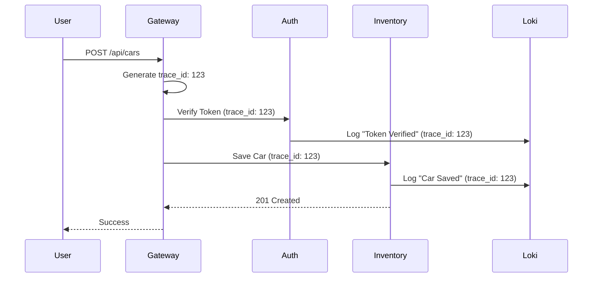

# Centralised Logging & Observability

To manage a distributed multi-tenant microservices architecture, CarBot AI uses a robust centralised logging and observability stack (LGTM: Loki, Grafana, Tempo, Mimir).

## 1. Centralised Logging Flow

All services produce structured logs in JSON format, which are then collected and aggregated.

### 1.1 Stack Components
- **Loki:** Log aggregation system.
- **Promtail:** Agent that ships logs from containers to Loki.
- **Grafana:** Dashboard for visualizing logs and metrics.

### 1.2 Log Structure
Every log entry MUST include:
- `timestamp`: ISO string.
- `level`: `info`, `warn`, `error`, `debug`.
- `service`: Service name (e.g., `auth-service`).
- `tenant_id`: For multi-tenant context.
- `trace_id`: Correlation ID for distributed tracing.
- `message`: Human-readable description.
- `metadata`: Key-value pairs of context (e.g., `car_id`, `phone`).

---

## 2. Structured Logging Pattern

```javascript
// Example structured log in Node.js
logger.info({
  tenant_id: "65e...",
  trace_id: "abc-123",
  car_id: "789...",
  action: "car_created"
}, "Successfully added new car to inventory");
```

---

## 3. Distributed Tracing (Correlation IDs)

When a request enters the API Gateway, a `trace_id` is generated and propagated to all downstream services via headers (`X-Trace-Id`).



---

## 4. Error Tracking & Alerts

- **Loki Alerts:** Triggers notifications to Slack/Email when error rates exceed a threshold.
- **Correlation:** Admins can search for a `trace_id` in Grafana to see the full lifecycle of a failed request across all microservices.

---

## 5. Metrics & Dashboards

- **Prometheus:** Collects system metrics (CPU, Memory, Request Latency).
- **Grafana Dashboards:**
  - Platform Health (Uptime of services).
  - Multi-tenant Activity (Messages per tenant).
  - AI Usage tracking (Gemini API costs/rate).
