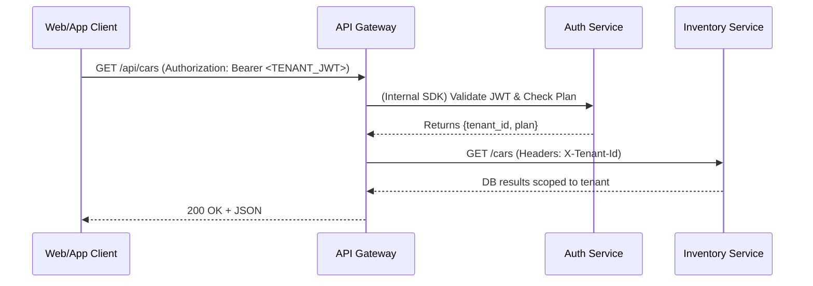
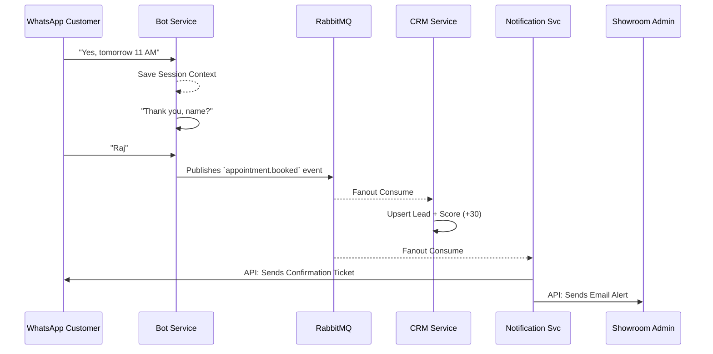

# 4. Service Communication & DB Interactions

### 4.1 Synchronous (REST) Communication
Synchronous calls are strictly limited to avoid cascading failures. Used primarily by the API Gateway to route to services, and Analytics/Billing Aggregating from other APIs where data freshness requires real-time pull over async.

### 4.2 Asynchronous (Event-Driven) Communication
RabbitMQ acts as the central nerve system. We use fanout / topic exchanges where Publisher knows nothing about Consumers.

**Benefits:**
- High availability (Bot keeps working if CRM is down).
- Scalability (We can add new consumers later, like Website Builder, without changing Inventory code).

### 4.3 Domain Event Catalog

| Event Topic | Published By | Consumed By | Payload Snapshot |
|-------------|-------------|-------------|------------------|
| `tenant.access_changed` | Auth | All Services | `{ tenant_id, is_active, plan }` (Cache refresh) |
| `car.added` | Inventory | Campaign, Website | `{ tenant_id, car_id, brand, budget_tier }` |
| `car.sold` | Inventory | Campaign, Analytics, Website | `{ tenant_id, car_id, profit, sold_price }` |
| `car.aging_alert`| Inventory | Notification | `{ tenant_id, car_id, days_in_stock }` |
| `insurance.expiring`| Inventory| Notification | `{ tenant_id, car_id, days_left }` |
| `lead.created` | CRM | Notification | `{ tenant_id, lead_id, name, score }` |
| `appointment.booked`| Bot | CRM, Notification | `{ tenant_id, phone, date, name, car_id }` |
| `lead.scored` | CRM | Notification | `{ tenant_id, lead_id, new_score, new_temperature }` |
| `campaign.scheduled`| Campaign | Campaign | Cron re-publishes to itself to trigger execution |
| `invoice.created` | Billing | Notification | `{ tenant_id, invoice_id, pdf_url, customer_phone }` |

### 4.4 Key Cross-Service Workflow: Test Drive Booking

1. **Bot Service (WhatsApp)**: Customer says "Book Date: 24th March".
2. **Bot DB**: Updates Session `state` to `CONFIRMED`.
3. **Bot Service**: Publishes `appointment.booked` to RabbitMQ.
4. **CRM Service (Consumer)**: Hears event.
   - Updates/Creates Lead matching phone.
   - Increases Lead Score (`+30`).
   - Inserts Activity timeline.
5. **Notification Service (Consumer)**: Hears event.
   - Calls Meta API: WhatsApps customer "Confirmation for 24th...".
   - Calls Resend API: Emails Showroom owner.

### 4.5 DB Interaction Rules (Service to DB)
1. **Never reach across DBs directly.** The Bot Service cannot read the `Car` Collection in Inventory DB.
2. **If Bot needs Car info:** Bot uses REST (e.g. `GET http://inventory:3002/internal/cars/search?q=hyundai`) or maintains its own materialized view via consuming `car.added` / `car.updated` events.
3. **Soft References:** Always store `ObjectId` (like `car_id` in Lead schema) as string-like soft references. Joins happen at the API Gateway level (API Composition) or via explicit UI sub-requests.
